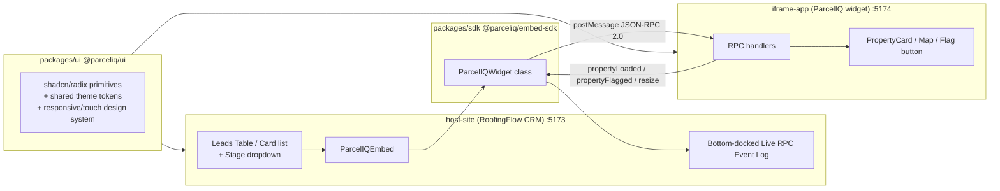

# ParcelIQ — an embedded widget POC

A proof-of-concept for a **composable widget** that any host CRM can embed directly
in its own UI, talking over a JSON-RPC 2.0 bridge — with a shared component library so
the widget always looks intentional, never like a bolted-on iframe.

- **`host-site`** — "RoofingFlow CRM," a fake CRM for roofing/home-services
  contractors, standing in for a real host application (Salesforce, HubSpot,
  ServiceTitan, ...).
- **`iframe-app`** — "ParcelIQ," the embeddable widget. Looks up a property
  via OpenStreetMap Nominatim, shows a Leaflet map + details, and can flag a
  property as distressed back to the host — live, no page reload.
- **`packages/sdk`** (`@parceliq/embed-sdk`) — the publishable-style SDK a
  host imports to mount the widget, call its methods, and subscribe to its
  events. This is the actual product surface.
- **`packages/ui`** (`@parceliq/ui`) — a shared shadcn/Radix/Tailwind
  component library consumed by both apps, so design tokens and behavior
  never drift between the host and the widget. Fully responsive down to
  phone widths (touch targets, collapsible mobile nav patterns, etc.).

Read [`ARCHITECTURE.md`](./ARCHITECTURE.md) for a full technical deep-dive —
how the SDK's JSON-RPC bridge works, how the UI library is structured and
consumed, how each app works internally, and how it all fits together end to
end. Read [`DEMO.md`](./DEMO.md) for the interview walkthrough, and
[`build-process.md`](./build-process.md) for the full build log, every real
decision made along the way, and the bugs that got found and fixed.

## Architecture



## Quickstart

```bash
yarn install
yarn dev
```

This starts both apps together:

- Host CRM: [http://localhost:5173](http://localhost:5173)
- Widget (standalone preview): [http://localhost:5174](http://localhost:5174)

Click a lead in the CRM to see the widget mount inside a `Sheet`, look up
that lead's address, and log every JSON-RPC message exchanged in the
bottom-docked "Show Live JSON-RPC Event Log" drawer. Try the "Flag as
Distressed" button inside the widget to see the bidirectional half of the
bridge — a badge appears on that lead's row in the CRM's own table, live.

Resize the window (or open dev tools' device toolbar) below `640px` to see
the leads table switch to a card-based list — this whole UI is responsive
down to phone widths, not just a desktop demo.

## Testing

```bash
yarn test           # run every workspace's tests once
yarn test:watch     # watch mode
yarn test:coverage  # with coverage
```

Vitest + React Testing Library + MSW, no Jest. 91 tests across all four
workspaces (`packages/sdk`, `packages/ui`, `host-site`, `iframe-app`).

## Repo structure

```
.
├── host-site/               # RoofingFlow CRM (the "host")
├── iframe-app/               # ParcelIQ widget (embedded via iframe)
├── packages/
│   ├── sdk/                    # @parceliq/embed-sdk — the embed SDK
│   └── ui/                      # @parceliq/ui — shared component library
├── ARCHITECTURE.md              # full technical deep-dive (read this first)
├── DEMO.md                      # interview walkthrough script
└── build-process.md             # full build log + decision record
```

Each app/package has its own `.cursor/rules/` — in particular
`packages/sdk/.cursor/rules/json-rpc-protocol.mdc`, which encodes the entire
JSON-RPC contract (envelope shape, origin validation, how to add a new
method/event) so an AI agent enforces it automatically on every future
change.

## Known limitations (deliberately not fixed — see `build-process.md` and `ARCHITECTURE.md`)

- Nominatim (geocoding) and OpenStreetMap tiles are free, key-less services
  meant for light usage — a production version would use a paid
  property-data and mapping API instead.
- Nominatim's search ranking is occasionally imprecise for ambiguous
  addresses (it isn't parcel-level accurate) — acceptable for a demo, not
  for production lead data.
- The widget's origin allowlisting trusts a `parentOrigin` query param set
  by the SDK; a production version would use a signed/config-driven
  allowlist instead of a client-suppliable value.
