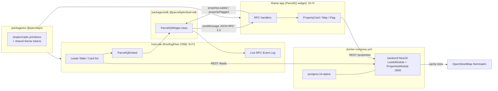

# ParcelIQ — an embedded widget POC

A proof-of-concept for a **composable widget** that any host CRM can embed directly
in its own UI, talking over a JSON-RPC 2.0 bridge — with a shared component library so
the widget always looks intentional, never like a bolted-on iframe.

- **`host-site`** — "RoofingFlow CRM," a fake CRM for roofing/home-services
  contractors, standing in for a real host application (Salesforce, HubSpot,
  ServiceTitan, ...). Persists leads through the Nest backend's **Leads** module.
- **`iframe-app`** — "ParcelIQ," the embeddable widget. Looks up a property
  via the Nest backend's **Properties** module (cached Nominatim proxy), shows a
  Leaflet map + details, and can flag a property as distressed back to the host —
  live, no page reload.
- **`backend`** — NestJS + Prisma + Postgres. One Docker process, two siloed
  domains: Leads (CRM) and Properties (widget). Treated as separate backends
  that happen to share a process for POC simplicity.
- **`packages/sdk`** (`@parceliq/embed-sdk`) — the publishable-style SDK a
  host imports to mount the widget, call its methods, and subscribe to its
  events. This is the actual product surface.
- **`packages/ui`** (`@parceliq/ui`) — a shared shadcn/Radix/Tailwind
  component library consumed by both apps, so design tokens and behavior
  never drift between the host and the widget. Fully responsive down to
  phone widths (touch targets, collapsible mobile nav patterns, etc.).

Read [`ARCHITECTURE.md`](./ARCHITECTURE.md) for a full technical deep-dive —
how the SDK's JSON-RPC bridge works, how the UI library is structured and
consumed, how each app works internally, and how it all fits together end to
end. Read [`DEMO.md`](./DEMO.md) for the interview walkthrough, and
[`build-process.md`](./build-process.md) for the full build log, every real
decision made along the way, and the bugs that got found and fixed.

## Architecture



## Quickstart

**Requires Docker Desktop** (Postgres + Nest backend) and Yarn.

```bash
yarn install
yarn dev
```

`yarn dev` brings up Postgres + the Nest backend via Docker Compose, then
starts both Vite frontends natively (fast HMR):

- Host CRM: [http://localhost:5173](http://localhost:5173)
- Widget (standalone preview): [http://localhost:5174](http://localhost:5174)
- API + Swagger: [http://localhost:3000/api/docs](http://localhost:3000/api/docs)

Helpers: `yarn dev:logs` (backend logs), `yarn dev:down` (stop Compose).

The CRM loads ~300 seeded leads via paginated `GET /leads?page&limit`
(25 per page), with TanStack Query caching each page and optimistic updates
on add/delete/stage/flag. Click a lead to mount the widget inside a
`Sheet`, look up that address, and watch JSON-RPC traffic in the
bottom-docked event log. "Flag as Distressed" marks the matching lead row
live via the bidirectional bridge.

Resize the window (or open dev tools' device toolbar) below `640px` to see
the leads table switch to a card-based list — this whole UI is responsive
down to phone widths, not just a desktop demo.

## Testing

```bash
yarn test           # every workspace (including backend unit tests)
yarn test:watch     # watch mode
yarn test:coverage  # with coverage
yarn workspace backend test:e2e   # Nest e2e against parceliq_test DB
```

Vitest + React Testing Library + MSW (frontends), Vitest + unplugin-swc
(backend). No Jest. 104 unit tests across five workspaces.

## Repo structure

```
.
├── backend/                 # NestJS + Prisma (Leads + Properties modules)
├── host-site/               # RoofingFlow CRM (the "host")
├── iframe-app/               # ParcelIQ widget (embedded via iframe)
├── docker-compose.yml        # Postgres + backend
├── packages/
│   ├── sdk/                    # @parceliq/embed-sdk — the embed SDK
│   └── ui/                      # @parceliq/ui — shared component library
├── ARCHITECTURE.md
├── DEMO.md
└── build-process.md
```

## Cursor rules

Each workspace has `.cursor/rules/*.mdc` (this repo's convention — not a
legacy root `.cursorrules` file):

- Every workspace includes `documentation.mdc` (`alwaysApply`) so agents
  update README / `ARCHITECTURE.md` / `build-process.md` in the **same
  turn** as behavior changes.
- `backend/.cursor/rules/` also encodes Nest/Prisma/Vitest standards and
  **domain siloing** (`domain-siloing.mdc`) so Leads and Properties stay
  logically separate.
- `packages/sdk/.cursor/rules/json-rpc-protocol.mdc` remains the source of
  truth for the RPC contract.

## Known limitations (deliberately not fixed — see `build-process.md` and `ARCHITECTURE.md`)

- Nominatim (geocoding) and OpenStreetMap tiles are free, key-less services
  meant for light usage — a production version would use a paid
  property-data and mapping API instead.
- CRM and widget backends share one Nest process / Postgres for the POC;
  production would likely split them into separate deployables (the modules
  already mirror that boundary).
- Nominatim's search ranking is occasionally imprecise for ambiguous
  addresses (it isn't parcel-level accurate) — acceptable for a demo, not
  for production lead data.
- The widget's origin allowlisting trusts a `parentOrigin` query param set
  by the SDK; a production version would use a signed/config-driven
  allowlist instead of a client-suppliable value.
- Auth / multi-tenancy is out of scope; tables carry a nullable `tenantId`
  placeholder for a future retrofit.
